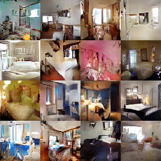
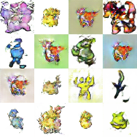
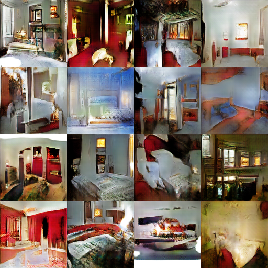
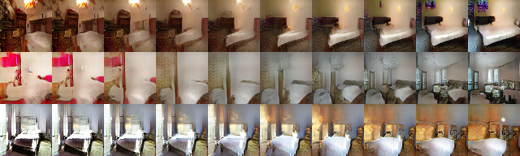
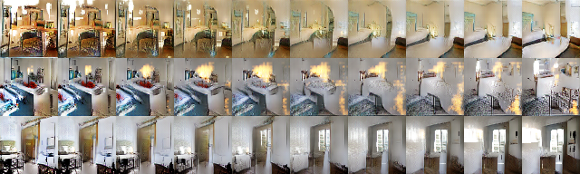

# theDCGANProject
This repository contains the version of our extended DCGAN implementation including additional Python scripts for loading the datasets and visualizing the results. This readme just provides an overview of our work, for a detailed investigation see our [paper](https://github.com/moejoe95/theDCGANProject/blob/master/paper.pdf).

## Goal of this repository

The project is based on work from [Radford et al. 2016](http://arxiv.org/abs/1511.06434).  In this students’ project, we summarize the main contributions from the paper and confirm some of the results with our own re-implementation.  Additionally, experiments on a new dataset, on the size of the utilized dataset, and investigations on the output and input dimensions of the model are performed.

## Datasets

We performed experiments on two datasets:

* [LSUN](https://github.com/fyu/lsun) bedrooms
* [Pokemons](https://medium.com/@yvanscher/using-gans-to-create-monsters-for-your-game-c1a3ece2f0a0) dataset

## Experiments

Experiments we performed on our re-implementation of the DCGAN:

* Confirm results of orignal paper (Figure 1)
* Train the DCGAN on a complete new dataset (Figure 2)
* Increase the output dimension of the generator to 128x128 (Figure 3)
* Investigate the effect of different sizes of the input vector by performing interpolations between random points in the latent space (Figure 4)
* Compare output images of a DCGAN trained on smaller datasets

### Results
1\. Reimplementation (3% of dataset)| 2\. Pokemon           |  3\. Output 128 x 128 x 3
:-------------------------:|:-------------------------:|:-------------------------:
 |  | 

4\. input vector = 20           |  
:-------------------------:|
  |

5\. input vector = 500           |  
:-------------------------:|
  |
